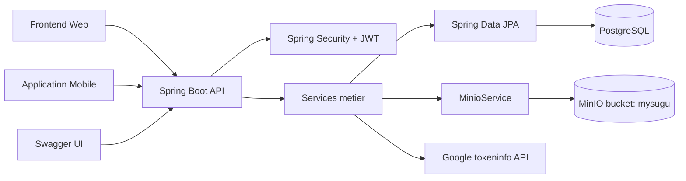
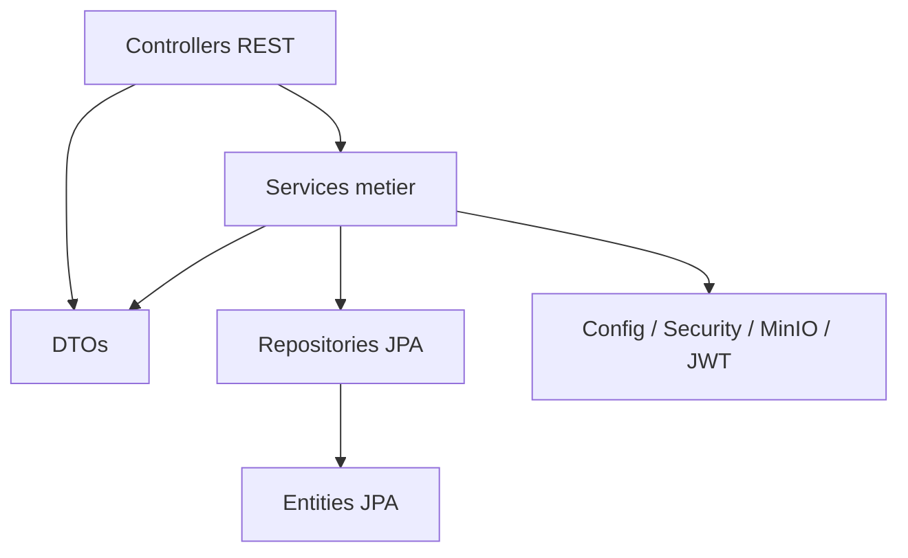
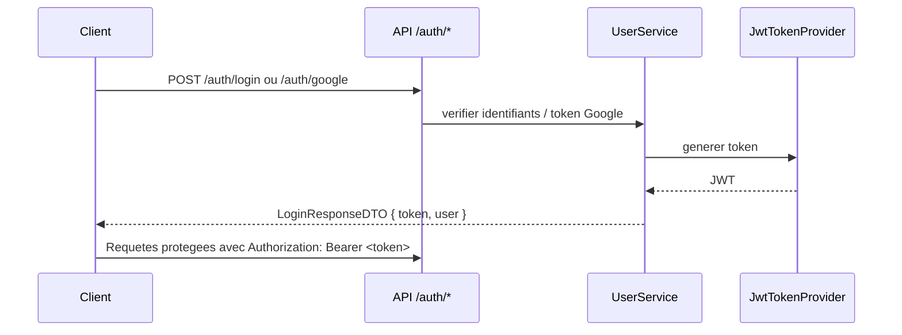
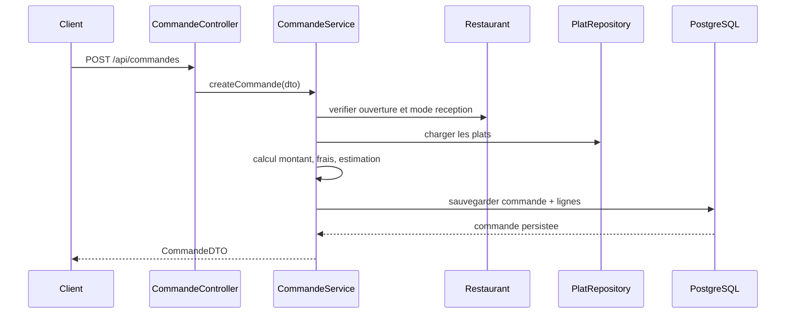
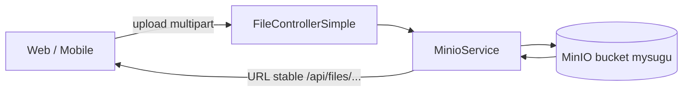

# Architecture MySugu

## Vue systeme

## Organisation en couches

## Principaux modules

- `controllers`: expose les endpoints REST.
- `services.interfaces`: contrats metier.
- `services.implementations`: logique applicative, validations et orchestration.
- `repositories`: acces aux donnees PostgreSQL.
- `entities`: modele persistant.
- `dtos`: contrats d'entree et de sortie de l'API.
- `config`: securite, Swagger, MinIO, Jackson, CORS.
- `util`: constantes et generation de numero de commande.

## Flux d'authentification JWT

## Flux de commande

## Gestion des fichiers

## Choix structurants

- Bucket MinIO unique: `mysugu`
- URLs de fichiers stables servies par l'application, pas de dependance metier aux presigned URLs temporaires
- Authentification stateless via JWT
- DTOs explicites pour isoler le modele de persistence
- Pagination Spring Data en mode `VIA_DTO`

## Packages cles

- `ma.mysuguclientapp.config`
- `ma.mysuguclientapp.config.security`
- `ma.mysuguclientapp.controllers`
- `ma.mysuguclientapp.services.implementations`
- `ma.mysuguclientapp.repositories`
- `ma.mysuguclientapp.entities`
- `ma.mysuguclientapp.dtos`

## Integrations externes

- PostgreSQL pour les donnees applicatives
- MinIO pour les fichiers
- Google `tokeninfo` pour la verification des `idToken`
- SMTP Gmail pour l'envoi d'emails
