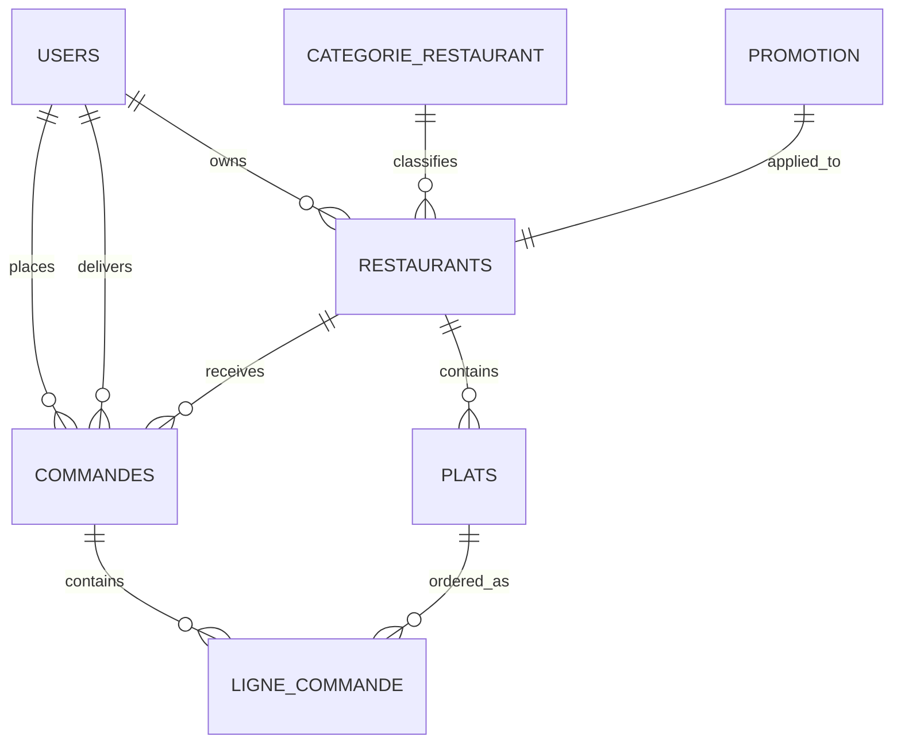

# Schema de base de donnees

## Vue d'ensemble

Le modele relationnel est centre sur les utilisateurs, les restaurants, les plats et les commandes.

## Tables principales

## `users`

Colonnes cle:

- `id`
- `email` unique
- `password`
- `nom`
- `prenom`
- `telephone`
- `role`
- `avatar`
- `is_active`
- `created_at`
- `updated_at`

Localisation embarquee:

- `latitude`
- `longitude`
- `adresse`
- `ville`
- `code_postal`
- `pays`

Valeurs de `role`:

- `CLIENT`
- `LIVREUR`
- `RESTAURANT_OWNER`
- `ADMIN`

## `restaurants`

Colonnes cle:

- `id`
- `nom`
- `description`
- `logo_url`
- `appreciation`
- `nombre_avis`
- `temps_livraison_moyen`
- `categorie_id`
- `owner_id`
- `promotion_id`
- `is_active`
- `auto_close_enabled`
- `heure_ouverture`
- `heure_fermeture`
- `horaires_ouverture`
- `created_at`

Localisation embarquee:

- `latitude`
- `longitude`
- `adresse`
- `ville`
- `code_postal`
- `pays`

## `plats`

Colonnes cle:

- `id`
- `nom`
- `description`
- `prix`
- `image_url`
- `restaurant_id`
- `is_available`
- `availability_mode`
- `indisponible_jusqua`
- `temps_preparation`
- `categorie_plat`

Valeurs de `availability_mode`:

- `DISPONIBLE`
- `INDISPONIBLE_TEMPORAIRE`
- `INDISPONIBLE_DEFINITIVE`

Ingredients:

- collection stockee dans `plat_ingredients`

## `commandes`

Colonnes cle:

- `id`
- `numero_commande` unique
- `client_id`
- `restaurant_id`
- `livreur_id`
- `statut`
- `mode_reception`
- `montant_total`
- `frais_livraison`
- `temps_livraison_estime`
- `commentaire`
- `raison_annulation`
- `methode_paiement`
- `statut_paiement`
- `created_at`
- `updated_at`
- `livree_at`

Adresse de livraison embarquee:

- `livraison_latitude`
- `livraison_longitude`
- `livraison_adresse`
- `livraison_ville`
- `livraison_code_postal`
- `livraison_pays`

Valeurs de `statut`:

- `EN_ATTENTE`
- `CONFIRMEE`
- `EN_PREPARATION`
- `PRETE`
- `EN_COURS`
- `LIVREE`
- `ANNULEE`
- `NON_FINALISEE`

Valeurs de `mode_reception`:

- `LIVRAISON`
- `RETRAIT_SUR_PLACE`

## `ligne_commande`

Colonnes cle:

- `id`
- `commande_id`
- `plat_id`
- `quantite`
- `prix_unitaire`
- `montant_total`
- `remarque`

## `categorie_restaurant`

Colonnes cle:

- `id`
- `nom`
- `description`
- `image_url`

## `promotion`

Colonnes cle:

- `id`
- `pourcentage`
- `date_debut`
- `date_fin`
- `description`
- `is_active`

## Objets embeddables

## `localisation`

Utilisee dans:

- `users`
- `restaurants`
- `commandes` pour l'adresse de livraison

Champs:

- `latitude`
- `longitude`
- `adresse`
- `ville`
- `codePostal`
- `pays`

## Regles metier impactant le schema

- `commandes.mode_reception` a un fallback applicatif sur `LIVRAISON`
- `plats.availability_mode` pilote `is_available`
- `restaurants.auto_close_enabled` active la fermeture automatique selon les heures
- les chemins de fichiers sont stockes sous forme d'`objectName` MinIO, puis exposes en URL par l'application

## Notes de migration

- Le projet utilise actuellement `spring.jpa.hibernate.ddl-auto=update`
- Pour les environnements sensibles, il est recommande d'introduire Flyway ou Liquibase pour versionner les evolutions de schema
- Les anciennes donnees de fichiers peuvent devoir etre normalisees vers le bucket unique `mysugu`
